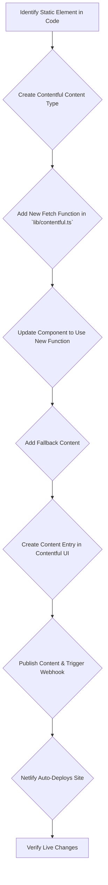

# Comprehensive Guide to Contentful CMS Integration

**Author:** Manus AI
**Date:** October 16, 2025

## 1. Introduction

This manual provides a comprehensive, step-by-step guide for integrating Contentful CMS into the Serenity Tides website. The goal is to empower developers and future AI agents to make any element on the website editable by non-technical users through the Contentful interface. By following these instructions, you can decouple content from code, enabling dynamic content updates without requiring new deployments for every text change.

This document adheres to the established pattern used for the homepage and About Us page integrations, ensuring consistency and maintainability across the project.

## 2. Prerequisites

Before you begin, ensure you have the following:

- **Access to the Codebase:** You must have access to the project's source code on your local machine or in the sandbox environment.
- **Contentful Account:** You need an active Contentful account with at least "Editor" role permissions for the "Serenity Tides Website" space.
- **Local Development Environment:** A working Next.js development environment to test changes locally.
- **Understanding of TypeScript and React:** Basic familiarity with these technologies is required to understand the code modifications.

## 3. High-Level Workflow

The integration process follows a clear, repeatable pattern that connects the frontend code to the Contentful CMS. The diagram below illustrates the end-to-end workflow from identifying a static element to making it dynamically manageable.



## 4. Step-by-Step Integration Guide

This section details the complete process for making a static piece of text on any page editable through Contentful.

### Step 1: Identify the Target Element

First, locate the static text or element in the codebase that you want to make editable. For this example, let's assume we want to make a new section on the About page, called "Our Story", editable.

In the file `/src/app/about/page.tsx`, you would find the hardcoded text:

```jsx
// Example of a new static section
<section className="mb-16">
  <h2 className="text-3xl font-bold text-center mb-4">Our Story</h2>
  <p className="text-lg text-muted-foreground max-w-3xl mx-auto">
    Serenity Tides was born from a shared passion for mindfulness and a desire to create a sanctuary for peace in the digital age. Our journey started with a small group of friends and has grown into a vibrant community.
  </p>
</section>
```

### Step 2: Create a Contentful Content Type

Next, you need to define a new "Content Type" in Contentful to hold this new piece of content. If you are adding a field to an *existing* content type (like adding a new text field to the `aboutPageContent`), you can skip creating a new content type and simply add a new field to the existing one.

1.  **Navigate to Contentful:** Log in and go to the **Content model** section.
2.  **Create Content Type:**
    *   Click **Add content type**.
    *   **Name:** `Our Story Section`
    *   **API Identifier:** `ourStorySection` (This must be unique and in camelCase).
3.  **Add a Field:**
    *   Click **Add field**.
    *   Choose the **Text** type.
    *   **Name:** `Story Text`
    *   **Field ID:** `storyText` (This must be unique within the content type).
4.  **Save** the content type.

> **Best Practice:** Use clear, descriptive names for your content types and fields. The API Identifier is what you will use in the code, so make it predictable.

### Step 3: Update Contentful Integration Code

Now, you need to update the code to fetch the new content type.

1.  **Define the Type:** In `/src/lib/contentful.ts`, add a new TypeScript interface for your content type.

    ```typescript
    export interface OurStorySectionEntry {
      fields: {
        storyText: string;
      };
    }
    ```

2.  **Create the Fetch Function:** In the same file, add a new asynchronous function to get the content from Contentful.

    ```typescript
    export async function getOurStorySectionContent(): Promise<OurStorySectionEntry | null> {
      if (!hasContentfulCredentials) {
        const { fallbackOurStorySectionContent } = await import('./contentful-fallback');
        return fallbackOurStorySectionContent;
      }

      try {
        const response = await client.getEntries({
          content_type: 'ourStorySection', // Use the API Identifier from Contentful
          limit: 1,
        });
        
        if (response.items.length > 0) {
          return response.items[0] as OurStorySectionEntry;
        } else {
          return null;
        }
      } catch (error) {
        console.error('Contentful API Error:', error);
        const { fallbackOurStorySectionContent } = await import('./contentful-fallback');
        return fallbackOurStorySectionContent;
      }
    }
    ```

### Step 4: Add Fallback Content

To ensure the site works correctly in a local development environment without Contentful credentials, add fallback data.

In `/src/lib/contentful-fallback.ts`, add the following:

```typescript
export const fallbackOurStorySectionContent = {
  fields: {
    storyText: "Serenity Tides was born from a shared passion for mindfulness and a desire to create a sanctuary for peace in the digital age. Our journey started with a small group of friends and has grown into a vibrant community."
  }
};
```

### Step 5: Update the Component

Now, modify the React component to fetch the data and display it.

In `/src/app/about/page.tsx`:

1.  **Import the new function and type:**

    ```typescript
    import { getOurStorySectionContent, type OurStorySectionEntry } from "@/lib/contentful";
    ```

2.  **Fetch the data in the component:**

    ```typescript
    export default async function AboutPage() {
      // ... existing data fetching
      const storyContent = await getOurStorySectionContent();
      
      return (
        // ... JSX
      );
    }
    ```

3.  **Replace the static text with the dynamic content:**

    ```jsx
    <section className="mb-16">
      <h2 className="text-3xl font-bold text-center mb-4">Our Story</h2>
      <p className="text-lg text-muted-foreground max-w-3xl mx-auto">
        {storyContent?.fields.storyText || "Default story text if CMS fails."}
      </p>
    </section>
    ```

### Step 6: Create and Publish Content Entry

With the code in place, the final step is to create the content in Contentful.

1.  Go to the **Content** section in Contentful.
2.  Click **Add entry** and select **Our Story Section**.
3.  Fill in the **Story Text** field with your desired content.
4.  Click **Publish**.

### Step 7: Test and Verify

After publishing, the Contentful webhook will automatically trigger a new build and deployment on Netlify. Wait a few minutes for the deployment to complete, then visit the live page to verify that your new content is visible.

For local testing, you can run `pnpm dev` and see the fallback content. If you have your `.env.local` file configured with Contentful credentials, you will see the live content from the CMS.

## 5. Best Practices

- **Consistent Naming:** Use a consistent naming convention for content types and fields (e.g., `camelCase` for API identifiers).
- **Use Fallbacks:** Always provide fallback content to ensure the site is resilient and can be developed offline.
- **Single Entry for Pages:** For page-specific content (like the About page), use a single content type and a single entry. This keeps all page-related content organized in one place.
- **Keep Secrets Safe:** Never commit API keys or other secrets to the repository. Use environment variables (`.env.local` for local development and Netlify environment variables for production).

## 6. Troubleshooting

- **Content Not Updating:**
    - Check the Netlify deployment logs for any build errors.
    - Verify that the webhook is configured correctly in Contentful and Netlify.
    - Ensure you published the content in Contentful, not just saved it as a draft.
- **Build Fails:**
    - Check that the API Identifiers in your code match the ones in Contentful exactly.
    - Make sure you have added the fallback content correctly.
    - Look for any TypeScript errors in your terminal.
- **Styling Issues:**
    - If the new content doesn't look right, check the JSX and CSS to ensure the new dynamic content is wrapped in the correct HTML tags with the proper classes.

