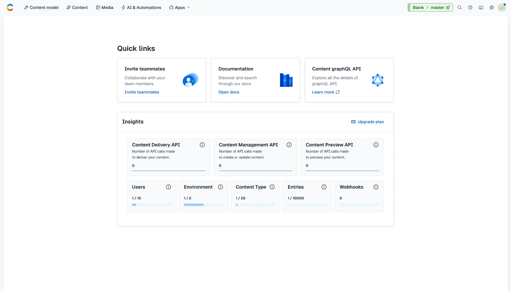
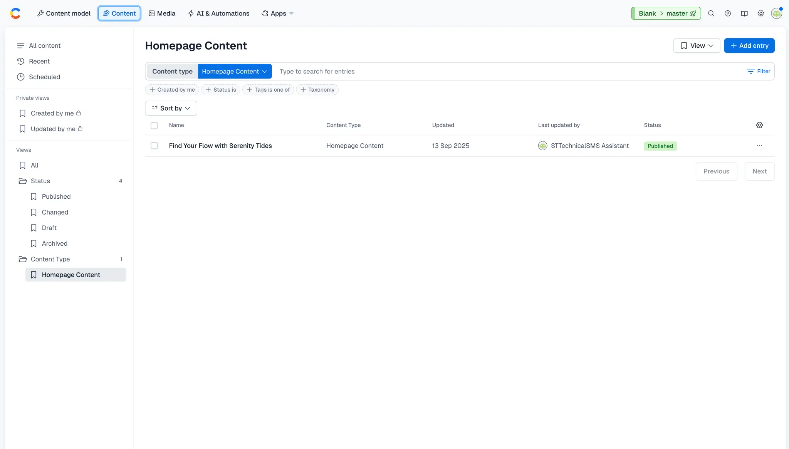
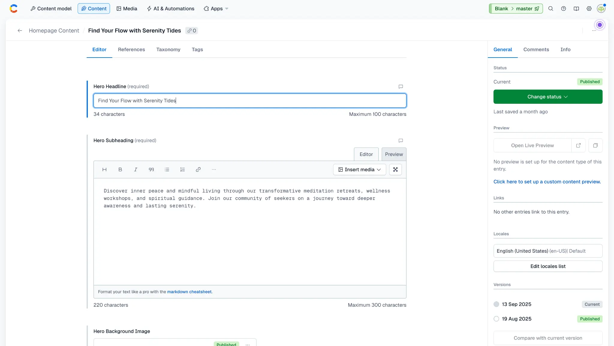
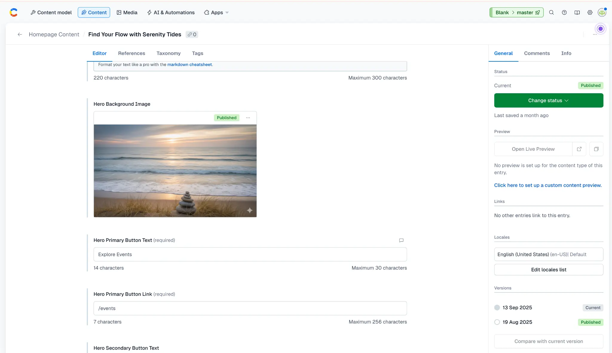
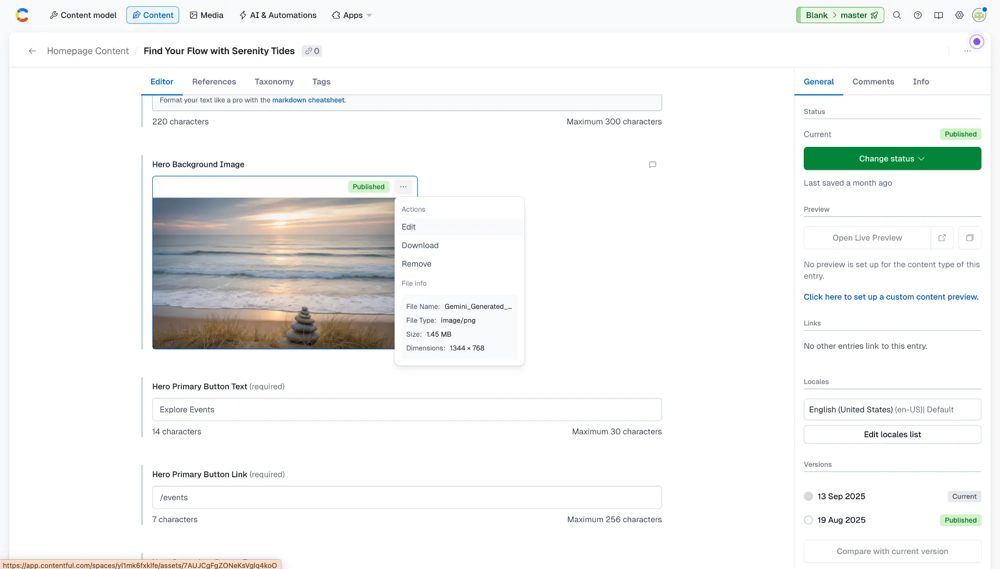
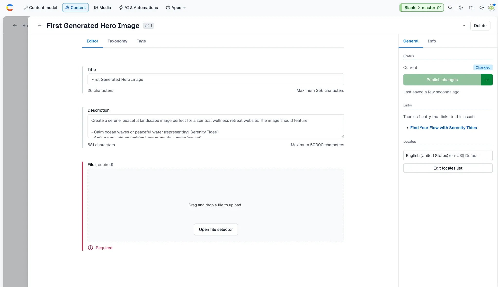
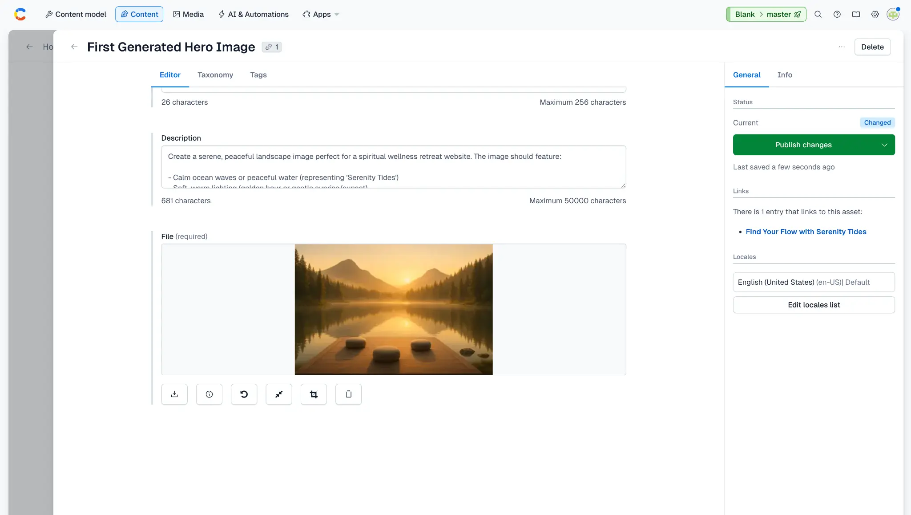
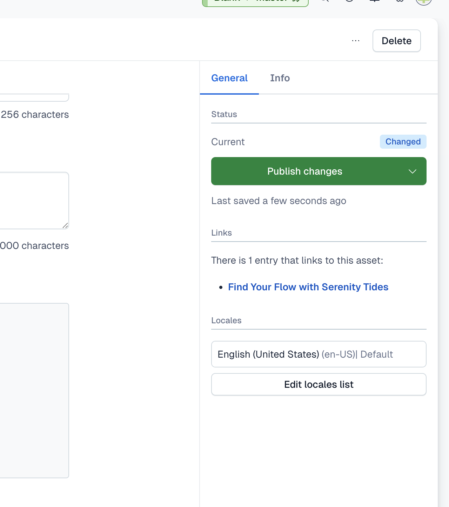

# Changing Content via Contentful

_A step-by-step guide for non-technical users on how to manage website content using Contentful CMS._

**Audience**: Non-technical users  
**Purpose**: This guide provides step-by-step instructions for updating content on the Serenity Tides website using the Contentful Content Management System (CMS). The examples focus on the homepage hero section, but the same principles apply to managing other content throughout the site.

---

## 1. Logging into Contentful

First, you need to log into your Contentful account to access the content management tools.

1.  **Open your web browser** and navigate to the [Contentful login page](https://be.contentful.com/login).

2.  **Enter your credentials** (email address and password) and click the **Log in** button.

    *If you have forgotten your password, use the "Forgot password?" link to reset it.*

    

---

## 2. Navigating to Content

Once logged in, you will be in your Contentful "Space." From here, you need to find the specific content entry you want to edit.

1.  From the main dashboard, click on the **Content** tab in the top navigation bar.

    

2.  You will see a list of all content entries. For this example, we'll edit the homepage content by clicking on **Homepage Content**.

    *Tip: If you have many content entries, you can use the search bar at the top to filter by name or use the sidebar filters to narrow by content type.*

3.  **Click on the entry name** to open the editor.

---

## 3. Editing Text Content

Inside the editor, you will see fields that correspond to the content on your website. The example below shows the homepage hero section fields.

1.  **To change the main headline**, locate the field labeled **Hero Headline** and type your new text into the text box.

2.  **To change the subheading**, locate the field labeled **Hero Subheading** and edit the text in the larger text box below the headline. This field supports rich text formatting.

    

    *Note: Different content types will have different fields. The principle remains the same - simply locate the field you want to edit and update the text.*

---

## 4. Changing Images

This section demonstrates how to replace an image in Contentful, using the hero background image as an example.

### Removing the Current Image

1.  Find the image field you want to update (e.g., **Hero Background Image**).

    

2.  Click the three dots (`...`) on the current image and select **Remove**.

    

### Uploading a New Image

3.  After removing the image, you'll see an empty field with upload options.

    

4.  You can either **drag and drop** your new image file into the window or click **Open file selector** to browse and upload from your device.

    *For best results with hero images, use high-quality, landscape-oriented images (e.g., 1920px wide by 1080px high).*

5.  Once the image is uploaded, it will appear in the field with action buttons below it.

    

---

## 5. Publishing Your Changes

After you have finished making your edits, you must publish the changes for them to appear on the live website.

1.  In the right-hand sidebar, you will see the status of your entry change to **"Changed"** (shown in blue).

2.  Click the green **Publish changes** button in the sidebar.

    

3.  After publishing, the status will change to **"Published"** (shown in green).

    

4.  The changes will now be live on the Serenity Tides website! It may take a minute or two for the changes to appear as the website's cache updates.

---

## Tips for Managing Content

- **Save frequently**: Contentful auto-saves your work, but it's good practice to check that "Last saved" timestamp updates regularly.
- **Preview before publishing**: While not set up for this content type yet, some entries may have preview options to see changes before they go live.
- **Unpublish if needed**: If you need to temporarily remove content, you can click "Change status" and select "Unpublish."
- **Check linked entries**: The sidebar shows if other entries link to the one you're editing, which is helpful for understanding content relationships.

---

## Need Help?

If you encounter any issues or have questions about managing content in Contentful, please don't hesitate to reach out for assistance.

---

*This guide was created to help non-technical users confidently manage website content. The same workflow applies to other content types in Contentful - simply navigate to the entry, make your changes, and publish!*

