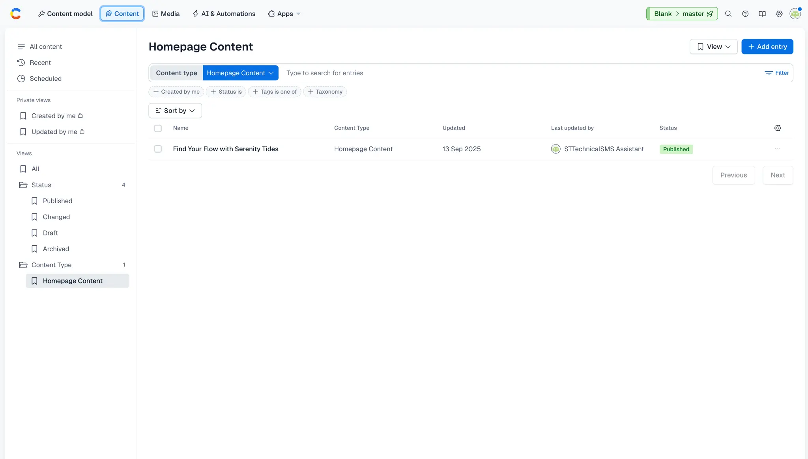
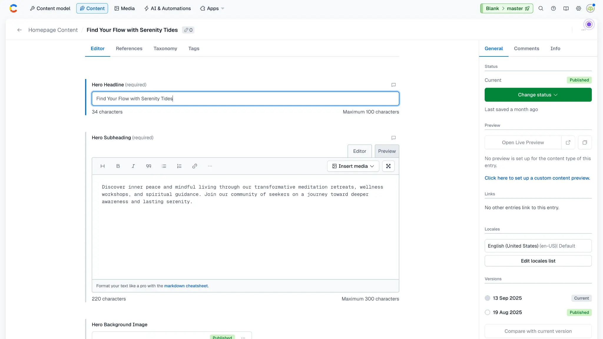
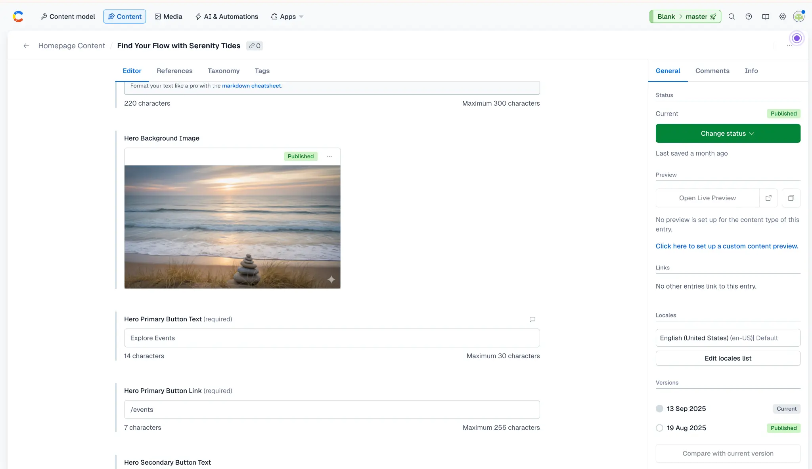

_A step-by-step guide for non-technical users on how to change content using Contentful, using the Hero Image as an example._

**Audience**: Non-technical users
**Purpose**: This guide provides step-by-step instructions for updating the content of the homepage hero section, including the main headline, subheading, and background image, using the Contentful Content Management System (CMS).

---

## 1. Logging into Contentful

First, you need to log into your Contentful account to access the content management tools.

1.  **Open your web browser** and navigate to the [Contentful login page](https://be.contentful.com/login).

2.  **Enter your credentials** (email address and password) and click the **Log in** button.

    *If you have forgotten your password, use the "Forgot password?" link to reset it.*

    

---

## 2. Navigating to the Homepage Content

Once logged in, you will be in your Contentful "Space." From here, you need to find the specific content entry for the homepage.

1.  From the main dashboard, click on the **Content** tab in the top navigation bar.

    

2.  You will see a list of all content entries. Look for an entry named **Find Your Flow with Serenity Tides**. It should be the only one of its kind.

    *Tip: If you have many content entries, you can use the search bar at the top to filter by the name.*

3.  **Click on "Find Your Flow with Serenity Tides"** to open the editor.

---

## 3. Editing the Hero Section Text

Inside the editor, you will see fields that correspond to the text on the homepage hero section.

1.  **To change the main headline**, locate the field labeled **Hero Headline** and type your new text into the text box.

2.  **To change the subheading**, locate the field labeled **Hero Subheading** and edit the text in the larger text box below the headline.

    

---

## 4. Changing the Hero Background Image

This is how you can swap out the main background image for the hero section.

1.  Find the field labeled **Hero Background Image**.

    

2.  Click the three dots (`...`) on the current image and select **Remove**.

    

3.  To add a new image, click the **Add media** button and choose **Add new media**.

    

4.  A new window will open. You can either **drag and drop** your new image file into the window or click **select files from your device** to upload it.

    *For best results, please use a high-quality, landscape-oriented image (e.g., 1920px wide by 1080px high).*

    

5.  Once the image is uploaded, click the green **Publish changes** button in the top right of the asset editor to make the image available for use.

    

6.  Close the asset editor to return to the homepage content editor. The new image should now be linked.

---

## 5. Saving and Publishing Your Changes

After you have finished making your edits, you must publish the changes for them to appear on the live website.

1.  In the right-hand sidebar of the homepage content editor, you will see the status of your entry (e.g., "Changed").

2.  Click the green **Publish** button.

    

3.  The changes will now be live on the Serenity Tides website! It may take a minute or two for the changes to appear as the website's cache updates.

---

Congratulations! You have successfully updated the homepage hero section. If you have any questions, please don't hesitate to reach out for assistance.

